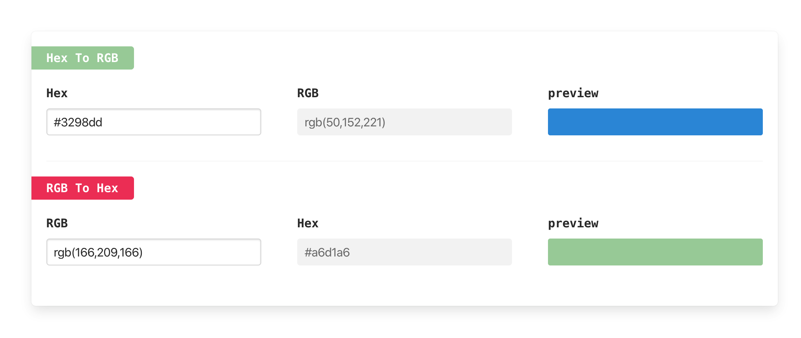

# color-converter

- convert rgb to hex 
- convert hex to rgb

# screen shot



# how to use

provide two method

- convertHexToRGB
- convertRGBToHex

```
 import { convertHexToRGB, convertRGBToHex } from "./index.js";
```
